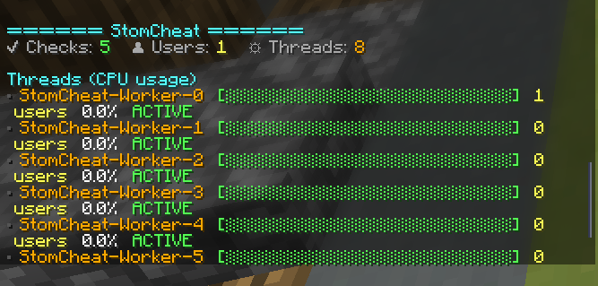

# StomCheat - Packet-Based AntiCheat Base for Minestom

A simple & optimized packet-based anticheat base for Minestom.

Packets are listened to and processed on a different thread assigned to the player on join & players are efficiently balanced across available threads.
This significantly improves performance, allowing it to process hundreds of players on the server without issues.

**DISCLAIMER: This is just a base for creating your own anticheat. It does not include real production ready checks. 
If you're searching for a real anticheat solution for your server, contact me @Athulsib on discord.**

## Features
- Packet-based & Lightweight
- Packet Listening & Processing
- User & Player data System
- Multi-threaded packet processing
- Annotation-Based Check System
- Simple & Easy-to-use





## Creating Checks
To create a check, simply create a class that extends `Check` and annotate it with `@CheckData`. Then override the `onPacket` method to handle incoming or outgoing packets.
After you've created your check, make sure to register it with the `CheckManager` like so:

```java
StomCheat stomCheat = /*your stomcheat insance*/

// method A, register a check by its class  
stomCheat.getCheckManager().registerCheck(BadPacketsA.class); // register the check class
// method B, register all checks from a package
stomCheat.getCheckManager().registerChecksFromPackage("com.example.ac.checks.impl"); // register all checks from a package
```
Here is an example of a simple check that detects impossible pitch rotations from the client:
```java
@CheckData(
        enabled = true,         // Whether the check should run, default: true
        name = "BadPackets",   
        type = "A",             // The subtype of the check, default: "A"
        description = "Basic impossible pitch check",
        punishmentVL = 3,       // Violations needed for punishment, default: 3
        experimental = false)   // Whether the check is experimental, default: false
public class BadPacketsA extends Check {

    @Override
    public void onPacket(PlayerPacketEvent event) {
        switch (PacketUtil.toPacketReceive(event)) {
            case CLIENT_LOOK:
            case CLIENT_POSITION:
            case CLIENT_POSITION_LOOK: {

                double pitch = Math.abs(getUser().getMovementProcessor().getTo().getPitch());

                if (pitch > 90.0) {
                    this.fail("Impossible pitch rotation",
                            "pitch=" + pitch);
                }

                break;
            }
        }
    }
}
```

## Creating Processors
To create a processor, simply create a class that extends `Processor` and annotate it with `@ProcessorData`. Then override the `onPacket` method to handle incoming or outgoing packets.
After you've created your processor, make sure to register it with the `ProcessorManager` like so:

```java
StomCheat stomCheat = /*your stomcheat insance*/

// method A, register a check by its class  
stomCheat.getProcessorManager().registerProcessor(CustomProcessor.class); // register the proccessor class
// method B, register all checks from a package
stomCheat.getProcessorManager().registerProcessorsFromPackage("com.example.ac.processors.impl"); // register all processors from a package
```

Here is an example of a processor:
```java
@ProcessorData(
        name = "example_processor",
        priority = 0, //the execution priority of the processor, 0 is the highest priority and will be executed first
        type = ProcessorType.CUSTOM //it is important to set the type to custom, otherwise there might be conflicts with existing Processors
)
public class ExampleProcessor extends Processor {
    
    public ExampleProcessor(User user) {
        super(user);
    }

    @Override
    public void onPacket(PlayerPacketEvent event) {
        switch (PacketUtil.toPacketReceive(event)) {
            case CLIENT_POSITION:
            case CLIENT_LOOK:
            case CLIENT_POSITION_LOOK: 
            case CLIENT_ENTITY_ACTION:
        }
    }

}
```

## Configuration System
The Anticheat creates a ```stomcheat_config.json``` where you can adjust the following values:
```json
{
  "loadDefaultChecks": true,
  "loadDefaultProcessors": true,
  "threadCount": 16,
  "alertMessage": "&6&lStomCheat &7&o>> &6%player% &fhas failed &6%check% %type% &8[VL:&r%vl%&7/%punishvl%&8] %experimental%",
  "experimental": "&c(DEV)",
  "hover": "&6Details:\n&eCheck: &a%check%\n&eType: &a%type%\n&eViolations: &a%vl%\n&ePing: &a%ping%ms\n&eDescription: &a%description%\n&eData: &a%data%\n",
  "broadcast": "\n&6&lStomCheat &8>> &e%s &bhas been removed from the Network\n&eReason: &cUnfair Advantage\n\n",
  "kickMessage": "\n&cYou have been removed from the Network\n&c[StomCheat] Unfair Advantage\n\n"
}
```

## Extensions System
To create an extension, simply create a class that extends `StomCheatExtension` and annotate it with `@ExtensionData`. Then override the `init` method.
After you've created your extension, make sure to register it with the `ExtensionManager` like so:

```java
StomCheat stomCheat = /*your stomcheat insance*/
stomCheat.enable();
stomCheat.getExtensionManager().loadExtensions(new ExampleExtension(), ...)
```

```java
@ExtensionData(
        name = "Test Extension",
        author = "Example Author",
        version = "0.0.1"
)
public class TestExtension implements StomCheatExtension {
    
    @Override
    public void init(StomCheat stomCheat) {
        //your logic here
    }
    
}
```

### Credits
Based on Serpent base by demondxv