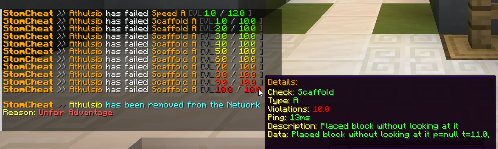

# StomCheat - Packet-Based AntiCheat Base for Minestom

A simple & optimized packet-based anticheat base for Minestom.

Packets are listened to and processed on a different thread assigned to the player on join & players are efficiently balanced across available threads.
This significantly improves performance, allowing it to process hundreds of players on the server without issues.

**DISCLAIMER: This is just a base for creating your own anticheat. It does not include real production ready checks. 
If you're searching for a real anticheat solution for your server, contact me @Athulsib on discord.**

## Features
- Packet-based & Lightweight
- Packet Listening & Processing
- User & Player data System
- Multi-threaded packet processing
- Annotation-Based Check System
- Simple & Easy-to-use





## Creating Checks
To create a check, simply create a class that extends `Check` and annotate it with `@CheckData`. Then override the `onPacket` method to handle incoming or outgoing packets.
Here is an example of a simple check that detects impossible pitch rotations from the client:
```java
@CheckData(
        enabled = true,         // Whether the check should run, default: true
        name = "BadPackets",   
        type = "A",             // The subtype of the check, default: "A"
        description = "Basic impossible pitch check",
        punishmentVL = 3,       // Violations needed for punishment, default: 3
        experimental = false)   // Whether the check is experimental, default: false
public class BadPacketsA extends Check {

    @Override
    public void onPacket(PlayerPacketEvent event) {
        switch (PacketUtil.toPacketReceive(event)) {
            case CLIENT_LOOK:
            case CLIENT_POSITION:
            case CLIENT_POSITION_LOOK: {

                double pitch = Math.abs(getUser().getMovementProcessor().getTo().getPitch());

                if (pitch > 90.0) {
                    this.fail("Impossible pitch rotation",
                            "pitch=" + pitch);
                }

                break;
            }
        }
    }
}
```

## "Configuration" System
This is a very simple project to help you create your own anticheat, so it does not include a real file based configuration system.
However, variables are stored in `StomCheatConfig` class, which you can just modify. 
```java
public class StomCheatConfig {
    private int threadCount = Math.min(Runtime.getRuntime().availableProcessors(), 16);

    private String alert = "&6&lStomCheat &7&o>> &6%player% &fhas failed &6%check% %type% &8[VL:&r%vl% &7/ %punishvl% &8]";

    private String hover =
            """
            &6Details:
            &eCheck: &a%check%
            &eType: &a%type%
            &eViolations: &a%vl%
            &ePing: &a%ping%ms
            &eDescription: &a%description%
            &eData: &a%data%
            """;

    String broadcast =
            """
            
            &6&lStomCheat &8>> &e%s &bhas been removed from the Network
            &eReason: &cUnfair Advantage
            
            """;

    String punishKick =
            """

            &cYou have been removed from the Network
            &c[StomCheat] Unfair Advantage

            """;

}

```


### Credits
Based on Serpent base by demondxv